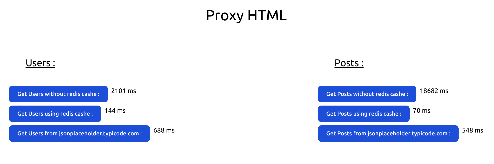

# Request-Cashe-Express-Redis-Mongodb

This project constitutes a simple API that fetches data from both a MongoDB database and an external API. It incorporates caching functionality using Redis to optimize performance and minimize database queries.

## Features

- **Node.js & Express.js**: Backend server architecture built upon Node.js and Express.js.
- **MongoDB**: Storage and retrieval of data from a MongoDB database.
- **External API Integration**: Fetching additional data from an external API source.
- **Redis Caching**: Employing Redis to cache MongoDB-fetched data for improved performance.
- **Request Execution Time Monitoring**: An interface displaying request execution times.

## Test : 

